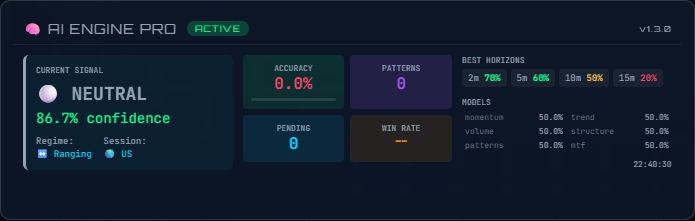
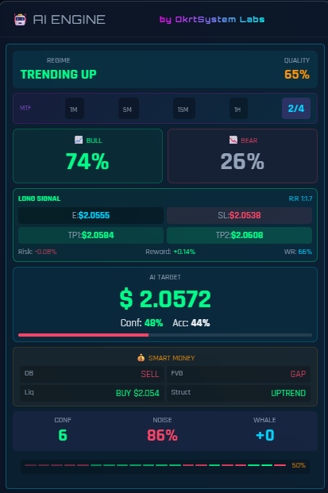

<div align="center">

# ORACULUM  
### Market Intelligence Dashboard for XRP — OkrtSystem Labs

**Real-time multi-feed + AI Engine PRO with auto-prediction and live performance metrics.**

> © 2025–2026 **OkrtSystem Labs** — All rights reserved.

</div>

---

## Table of Contents
- [Overview](#overview)
- [Key Features](#key-features)
- [AI ENGINE PRO](#ai-engine-pro)
- [Live Accuracy Update](#live-accuracy-update)
- [Screenshots](#screenshots)
- [Run ORACULUM](#run-oraculum)
  - [Web (local server)](#web-local-server)
  - [Desktop App (Windows Installer)](#desktop-app-windows-installer)
- [Technical Notes](#technical-notes)
- [Security](#security)
- [Roadmap](#roadmap)
- [License](#license)

---

## Overview

**ORACULUM** is a real-time market intelligence dashboard designed to monitor **XRP** across multiple exchanges, displaying key telemetry, liquidity/flow signals and an integrated **AI Engine** capable of generating **multi-horizon predictions**, validating results and improving over time.

This project is built and maintained by **OkrtSystem Labs**, oriented to a **high-performance, enterprise-looking UI** with a **robust feed layer** and an AI module ready for long-running sessions.

---

## Key Features

### Real-time Multi-Feed (Failover)
- WebSocket streaming from multiple sources  
- Automatic feed failover logic *(e.g., Binance → Coinbase → Kraken)*
- Designed for long sessions with recovery patterns

### AI ENGINE PRO (Integrated)
- Auto-prediction cycles
- Multi-horizon validation
- Performance tracking + “Best Horizon” signal
- State persistence supported *(Firestore when enabled)*

### Dashboard Experience
- Compact, readable cards & telemetry blocks  
- Designed for desktop, ultrawide and long-running usage  
- Fast, single-file delivery (web build) + installable desktop packaging

---

## AI ENGINE PRO

The **AI ENGINE PRO** module runs as a self-contained engine connected to the live market feed:

### Workflow
1. **Market ingestion**
   - Receives price/candle data from connectors.
2. **Auto-prediction generation**
   - Creates prediction jobs at fixed intervals.
3. **Verification & scoring**
   - Validates each prediction against configured horizons.
4. **Metrics & optimization**
   - Updates accuracy, best horizon, pending queue and memory patterns.

### Default Horizons
`2m, 5m, 10m, 15m, 30m, 60m, 120m, 240m`

### UI Metrics (AI ENGINE PRO Card)
- **Status**: engine state (READY, etc.)
- **Accuracy**: live + consolidated accuracy
- **Patterns**: learned patterns stored in memory
- **Pending**: active predictions waiting validation
- **Best H**: best-performing horizon in current runtime

---

## Live Accuracy Update

Previously, during the first hours of runtime, **Accuracy** could remain at **0.0%** even though the engine was working correctly.

### Why it happened
Global accuracy was primarily consolidated after completing long-horizon predictions  
(e.g., `240m = 4 hours`).  
Before the first full prediction was closed, the UI had little to display.

### What’s improved now (PRO approach)
ORACULUM now computes an **in-live provisional accuracy** based on validated short/medium horizons (`2m/5m/10m/...`) **without changing the true final scoring logic**.

✅ Accuracy becomes meaningful within minutes  
✅ Final accuracy remains authoritative after full horizon completion  
✅ No changes to the AI workflow, UI layout or prediction model behavior

---

## Screenshots

> Screenshots are included from `docs/screens/` (relative paths from this README).  
> Ensure filenames match exactly (case-sensitive on GitHub).

<div align="center">

**AI ENGINE PRO — Live Metrics Card**  


<br/>

**Runtime Console — Engine Loading + Feeds Connected**  


</div>

---

## Run ORACULUM

### Web (local server)

Recommended to avoid `file://` execution.

```bash
python -m http.server 8080
```

Open:
- `http://localhost:8080`

---

## Technical Notes

### Browser warning: ResizeObserver loop
You may occasionally see:

`ResizeObserver loop completed with undelivered notifications`

This is a common dashboard/UI warning in Chrome/Edge when layouts resize rapidly during frequent updates.  
In normal conditions it does **not** affect ORACULUM’s functionality.

---

## Security

Depending on build configuration, ORACULUM supports:
- **App Check enabled mode**
- CSP hardening paths
- safer UI rendering patterns (anti-self-XSS discipline)

---

## License

**Proprietary Software**  
© 2025–2026 OkrtSystem Labs — All rights reserved.

No redistribution, modification or commercial use without explicit authorization.
