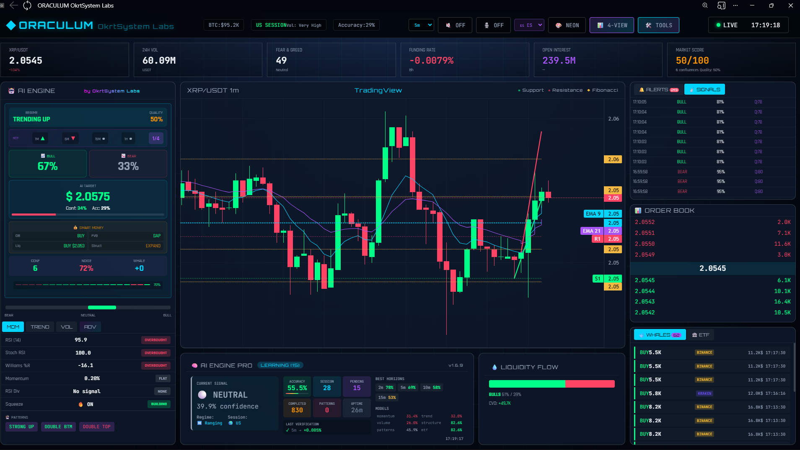
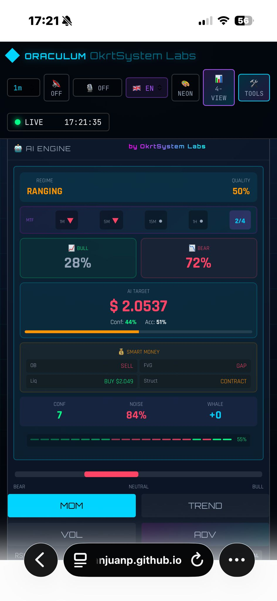
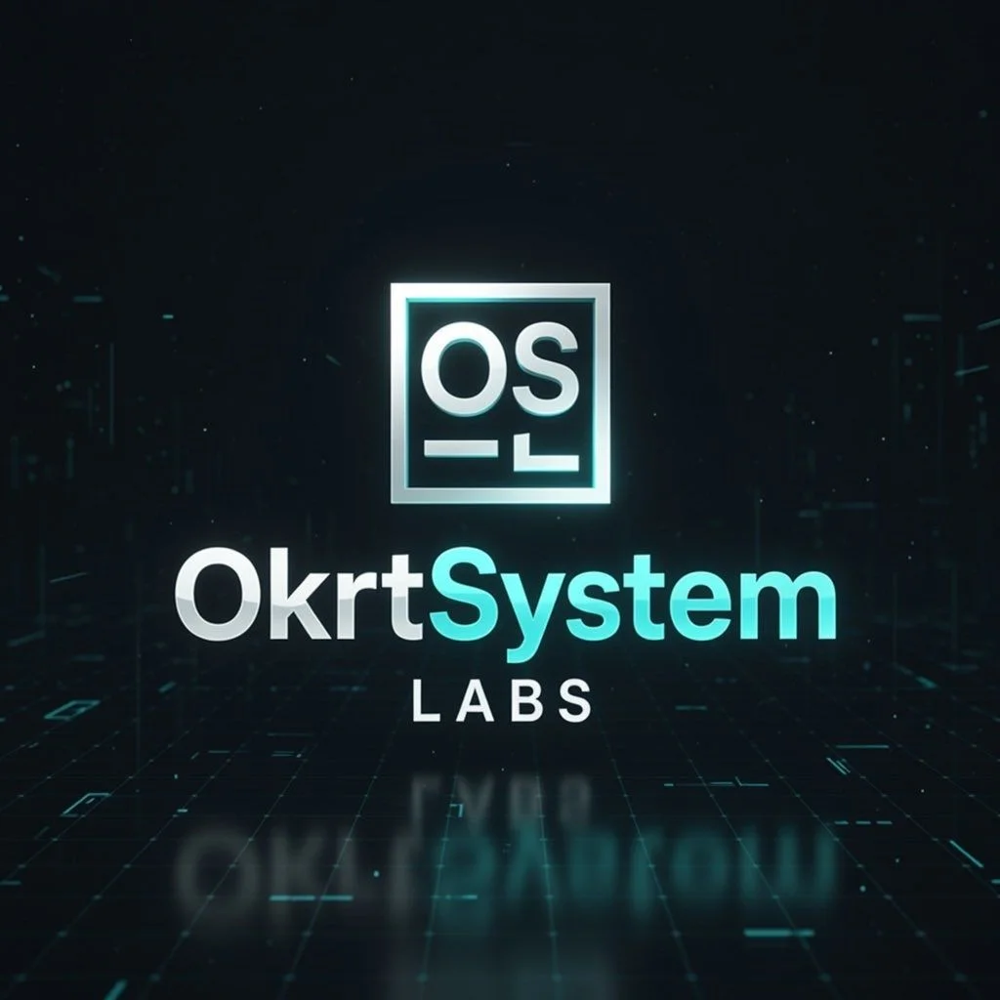

# ORACULUM — OkrtSystem Labs  
### Real‑Time Market Intelligence + AI Engine PRO (Self‑Learning) · Web App (Desktop + Mobile)

> **ORACULUM** es un panel operativo de inteligencia de mercado diseñado para **tomar el pulso a XRP/USDT en tiempo real**, detectar señales, visualizar estructura y ejecutar un **motor de aprendizaje continuo** orientado a precisión, estabilidad y rendimiento en producción.

---

## Lo que hace ORACULUM (en una frase)
**Convierte streams de mercado en decisión accionable**: *datos → contexto → señales → aprendizaje → memoria → optimización*.

---

## Highlights (por qué es diferente)
- **Tiempo real de verdad**: integración con feeds/streams para un flujo continuo de datos.
- **AI ENGINE PRO v1.6.9**: motor de aprendizaje siempre activo con:
  - **Auto‑Prediction** con horizontes configurables  
  - **Ensemble** y umbral de confianza  
  - **Optimización automática** para mejorar precisión con el tiempo  
  - **Memoria** y patrones persistentes por usuario
- **Persistencia segura multiusuario (Firebase/Firestore)**:
  - Estado **scoped por UID** (aislamiento por usuario)
  - Validación en reglas
  - Ahorro de cuota: escrituras **deduplicadas** cuando el estado no cambia
- **Rendimiento y estabilidad**:
  - Capping de cola de predicciones (mantiene las últimas, descarta antiguas)
  - Guardado robusto y control de frecuencia
- **UI “Enterprise‑grade”**:
  - Tarjetas modulares, lectura rápida, jerarquía visual
  - **Mobile‑first real**: en iPhone las cards se muestran **independientes y apiladas**, sin solapes

---

## Arquitectura (visión clara)
**ORACULUM (Front)**
- UI + dashboards + paneles operativos
- Motor AI (cliente) para predicción y aprendizaje
- Capa de persistencia (Firestore)

**Fuentes (Feeds)**
- Streams/REST de mercado (con failover en el feed manager)

**Persistencia**
- **Cloud Firestore**: estado del motor AI por usuario

---

## Componentes principales
- `index.html` — Aplicación web (UI + layout + wiring de módulos)
- `ai-engine-pro.js` — **AI ENGINE PRO** (predicción, memoria, optimización, persistencia)
- `market-feed-manager.js` — Gestión de datos de mercado (streaming/failover)

> ORACULUM está diseñado para desplegarse de forma simple (GitHub Pages / hosting estático) con un backend gestionado (Firebase).

---

## Seguridad (en serio)
ORACULUM está pensado para un repositorio público sin exponer el sistema a envenenamiento de datos:

- Legacy **`/ai/*` en solo lectura** (escritura bloqueada para evitar poisoning)
- Persistencia **por usuario** en:
  - `aiUsers/{uid}/engine/{docId}`
- Reglas con validaciones conservadoras y **catch‑all deny**
- Autenticación anónima compatible (UID aislado por sesión/navegador)
- Integrable con App Check / endurecimiento adicional

---

## Firestore (modelo de datos)
Documentos del motor (por usuario):

- `pro_models` — estadísticas por modelo (momentum/trend/volume/structure/patterns/mtf)
- `pro_memory` — memoria/patrones y correlaciones
- `pro_performance` — telemetría y métricas internas del motor
- `pro_horizons` — precisión por horizonte (2,5,10,15,30,60,120,240)
- `pro_pending` — cola de predicciones (**cap 25**)

---
# 🧠 AI ENGINE PRO  
### Intelligent Market Analysis Engine  
**by OkrtSystem Labs**


---

## 🚀 ¿Qué es AI ENGINE PRO?

**AI ENGINE PRO** es un motor avanzado de análisis predictivo asistido por inteligencia artificial, diseñado para **interpretar el contexto del mercado en tiempo real** y determinar si existe o no una **ventaja estadística real para operar**.

No es un bot de trading automático.  
No fuerza señales.  
No “predice por predecir”.

Su misión es clara:

> **Operar solo cuando el mercado ofrece una ventaja medible.**

---

## 🧭 Filosofía del motor

AI ENGINE PRO prioriza:
- **Precisión sobre frecuencia**
- **Disciplina sobre sobreoperar**
- **Contexto sobre impulsos**

Una señal **NEUTRAL** no es un fallo:  
es una decisión consciente de **no asumir riesgo innecesario**.

---

## 🖥️ Guía de interpretación del panel

### 1️⃣ CURRENT SIGNAL

#### 🔹 Signal: BULL / BEAR / NEUTRAL
Indica el **sesgo operativo recomendado** según el análisis conjunto del motor:

- **BULL** → Ventaja estadística alcista
- **BEAR** → Ventaja estadística bajista
- **NEUTRAL** → No existe ventaja clara

> NEUTRAL significa *“esperar”*, no *“dudar”*.

---

#### 🔹 Confidence (%)
Nivel de **confianza estadística real** de la señal.

- No es una promesa
- No es una probabilidad teórica
- Es una **confianza calibrada según resultados históricos verificados**

---

### 2️⃣ REGIME & SESSION

#### 🔹 Regime
Describe el **tipo de mercado detectado**:

- **Ranging** → Mercado lateral, alta probabilidad de falsas señales
- **Trending Up / Down** → Tendencia definida

El motor **adapta su agresividad y umbrales** según el régimen.

---

#### 🔹 Session
Identifica la **sesión activa** (US / EU / Asia), influyendo directamente en:
- Volumen
- Liquidez
- Fiabilidad de señales

---

### 3️⃣ ACCURACY & PERFORMANCE

#### 🔹 Accuracy
Porcentaje de acierto **real y verificado**, no simulado.

- Solo se calcula sobre predicciones cerradas
- Refleja rendimiento histórico en condiciones reales

> Un 52–55% sostenido es **muy sólido**, especialmente en mercados laterales.

---

#### 🔹 Completed / Pending
- **Completed** → Predicciones ya verificadas
- **Pending** → Predicciones en evaluación

El sistema **limita deliberadamente** las predicciones pendientes para:
- Evitar sobreoperar
- Reducir ruido estadístico
- Mantener estabilidad del motor

---

### 4️⃣ BEST HORIZONS

Muestra los **marcos temporales donde el motor es más fiable**:

Ejemplo:
- **2m → 74%**
- **5m → 64%**
- **10m → 59%**
- **15m → 55%**

Permite al usuario:
- Operar donde existe mayor ventaja
- Evitar horizontes poco fiables en ese contexto

---

### 5️⃣ MODELS (Componentes del análisis)

AI ENGINE PRO combina múltiples enfoques:

- **Momentum** → Fuerza del movimiento
- **Trend** → Dirección sostenida
- **Volume** → Confirmación por participación
- **Structure** → Soportes, resistencias, estructura de mercado
- **MTF** → Coherencia entre marcos temporales
- **Patterns** → Patrones aprendidos y verificados

Cada porcentaje indica **peso y relevancia actual**, no un valor fijo.

---

### 6️⃣ LAST VERIFICATION

Resultado de la última predicción cerrada:

- Horizonte temporal
- Resultado real (%)
- ✔️ Acierto / ❌ Fallo

Esto aporta **transparencia total** y autoauditoría continua.

---

### 7️⃣ LEARNING MODE

Cuando aparece `LEARNING (XX)`:

- El motor está **ajustando calibraciones internas**
- Optimiza umbrales, confianza y pesos
- Aprende del mercado **en tiempo real**

> AI ENGINE PRO no repite reglas fijas. Evoluciona.

---

## 📌 Mensaje clave para el usuario

> **AI ENGINE PRO no intenta predecir siempre.  
> Intenta acertar cuando merece la pena.**

Si la señal es **NEUTRAL**:
- El mercado no ofrece ventaja
- El riesgo supera al beneficio esperado
- La mejor decisión puede ser **no operar**

---

## 🏁 Conclusión

AI ENGINE PRO es una herramienta de **lectura del mercado**, no de impulsos.  
Está diseñada para traders que valoran:
- Disciplina
- Contexto
- Estadística real

**Operar menos, pero mejor.**

---

© 2025–2026 **OkrtSystem Labs**  
All rights reserved.


## Operativa y verificación
En consola (DevTools) deberías ver:
- `State loaded from Firestore (scoped)`
- `AI Engine PRO ready`
- Auto‑predicción en ciclos

Verificación rápida del build:
```js
AIEnginePro.__okrtBuild
```

---

## Rendimiento (principios)
- Escrituras deduplicadas (no se guarda si el estado no cambia)
- Cap de `pending` para evitar crecimiento infinito
- Layout responsive sin reflows destructivos en móvil
- Diseño “observability‑first”: logs útiles para diagnóstico


---

## Capturas






[](https://franjuanp.github.io/OkrtSystemLabs/)


---

## Disclaimer
ORACULUM es una herramienta de análisis y visualización. No constituye asesoramiento financiero.

---

## Licencia / Copyright
© 2025–2026 OkrtSystem Labs. Todos los derechos reservados.

---

### Autor / Branding
OkrtSystem Labs · ORACULUM  
Diseñado para rendimiento, seguridad y presencia “production‑grade”.
